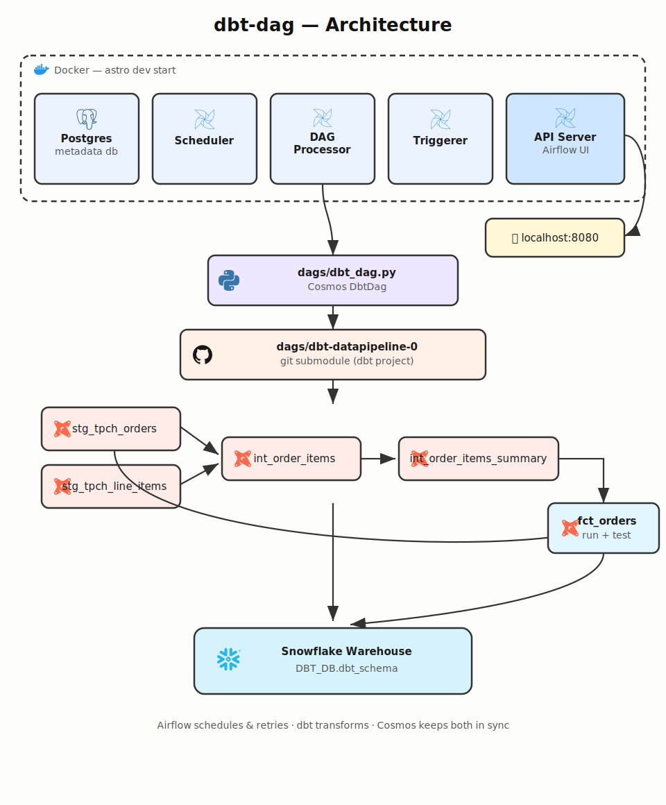
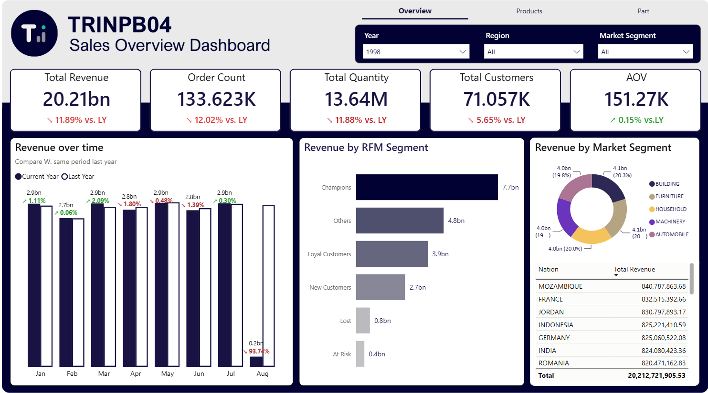

<div align="center">

# ❄️ dbt-dag

**Apache Airflow + astronomer-cosmos + dbt + Snowflake**, fully containerized with the Astro CLI.

A production-style local sandbox where dbt models become native Airflow tasks — no hand-written `BashOperator` glue code.

[](https://airflow.apache.org/)
[](https://www.getdbt.com/)
[](https://astronomer.github.io/astronomer-cosmos/)
[](https://www.snowflake.com/)
[](https://www.docker.com/)

</div>

---

## What is this?

This repo orchestrates a dbt project (vendored directly under `dags/dbt-datapipeline-0/`) through Apache Airflow using [`astronomer-cosmos`](https://astronomer.github.io/astronomer-cosmos/). Every dbt model gets automatically converted into its own Airflow task, wired up with the exact same dependency graph dbt already knows about — `ref()` and `source()` become upstream/downstream task edges for free.

The pipeline lands transformed marts (dimensions, fact tables, cohort analysis, RFM segmentation) in Snowflake, which then feed a Power BI **Sales Dashboard** for the reporting layer.

## Architecture



*(This is the real task graph Cosmos generates in the Airflow UI — see the [Graph View](http://localhost:8080) after `astro dev start`.)*

## Project structure

```
dbt-dag/
├── dags/
│   ├── dbt_dag.py                 # Cosmos DbtDag — the actual orchestration
│   └── dbt-datapipeline-0/        # the dbt project itself (vendored, not a submodule)
├── Dockerfile                     # Astro Runtime image + a dedicated dbt venv
├── requirements.txt                # astronomer-cosmos, airflow-providers-snowflake
├── airflow_settings.yaml          # LOCAL ONLY, gitignored — connections/vars live here
└── README.md
```

Why a separate `dbt_venv` in the `Dockerfile`? `dbt-core` and `apache-airflow` frequently pin conflicting dependency versions, so `dbt-snowflake` is installed into its own virtualenv at build time and invoked by absolute path from the DAG, instead of sharing Airflow's Python environment.

## Prerequisites

- [Docker](https://docs.docker.com/get-docker/) (Docker Desktop, or `docker-ce` running natively — either works)
- [Astro CLI](https://www.astronomer.io/docs/astro/cli/install-cli)
- A Snowflake account with a warehouse, role, and a `DBT_DB` database you can write to

## Quickstart

```bash
# 1. Clone the repo
git clone git@github.com:trinpb04/dbt-dag.git
cd dbt-dag

# 2. Create your local connection config (this file is gitignored on purpose)
cp airflow_settings.example.yaml airflow_settings.yaml
# ...then fill in your real Snowflake credentials (see below)

# 3. Start Airflow
astro dev start
```

Once the containers are healthy, open **http://localhost:8080** (default login `admin` / `admin`), unpause `dbt_dag`, and trigger a run.

## Configuring the Snowflake connection

`astro dev start` reads connections from `airflow_settings.yaml` (local dev only — never committed). The Snowflake profile is built by Cosmos' `SnowflakeUserPasswordProfileMapping`, which pulls fields from the Airflow connection like this:

| dbt profile field | Airflow connection field       |
|--------------------|---------------------------------|
| `account`          | `conn_extra.account`           |
| `warehouse`        | `conn_extra.warehouse`         |
| `role`             | `conn_extra.role` (optional)   |
| `user`             | `conn_login`                   |
| `password`         | `conn_password`                |
| `schema`           | `conn_schema`                  |
| `database`         | set in `dbt_dag.py` `profile_args` |

Template:

```yaml
airflow:
  connections:
    - conn_id: "your_snowflake_conn"
      conn_type: "snowflake"
      conn_host: "<org>-<account>.snowflakecomputing.com"
      conn_schema: "dbt_schema"
      conn_login: "<your_username>"
      conn_password: "<your_password>"
      conn_extra:
        account: "<org>-<account>"      # same as the org-account part of the host, hyphen-separated
        warehouse: "dbt_wh"
        role: "dbt_role"
```

> ⚠️ **Account identifier format matters.** Newer Snowflake accounts use `ORG-ACCOUNT` (hyphen). Don't swap it for a dot — `ORG.ACCOUNT` will resolve to a nonexistent host and fail with a `404` at login.

Make sure `conn_id` here matches the one referenced in [`dags/dbt_dag.py`](dags/dbt_dag.py), and that `profile_name` in the same file matches the `profile:` key inside the dbt project's `dbt_project.yml`.

## How it works

1. **Cosmos parses the dbt project** (`ProjectConfig`) and resolves the model dependency graph via `dbt ls`.
2. **Each dbt model becomes an Airflow task.** `ref()`/`source()` relationships become task dependencies — see the lineage diagram above.
3. **Each task shells out to the real `dbt` binary** (`dbt_venv/bin/dbt`) with a profile generated on the fly from the Airflow connection, then runs `dbt run --select <model>` (or `test`, for the test tasks).

Airflow owns scheduling, retries, and observability; dbt owns the actual SQL transformation logic in Snowflake; Cosmos is the glue that keeps both in sync automatically whenever the dbt project changes.

## Power BI Dashboard

The Snowflake marts feed a single-page **Sales Dashboard** built in Power BI — KPI cards with YoY growth indicators, revenue trend, RFM segmentation, and market segment breakdown.



**[Open the live dashboard](https://app.powerbi.com/view?r=eyJrIjoiNDQ3ZWEzN2QtYjA4ZC00NWVkLTg4NjMtMThlNWRiOWU2N2I3IiwidCI6IjM3MGZiM2I4LTMzMDYtNDg5MC05MDYzLWNjMDhiZTc4ODI1NyIsImMiOjEwfQ%3D%3D&embedImagePlaceholder=true)** (published to web, no login required)

## Troubleshooting

Real errors hit while building this, kept here so nobody has to rediscover them:

| Symptom | Cause | Fix |
|---|---|---|
| `Unable to find the dbt executable` | `dbt_executable_path` pointed at the `airflow` binary instead of `dbt` | Point it at `$AIRFLOW_HOME/dbt_venv/bin/dbt` |
| `Could not find profile named ...` | `profile_name` in `dbt_dag.py` didn't match `profile:` in `dbt_project.yml` | Keep both in sync |
| `Credentials ... invalid: 'account' is a required property` | `conn_extra` was missing `account`/`warehouse` | Add them under `conn_extra` (see template above) |
| `404 Not Found` on login | Account identifier used `.` instead of `-` | Use `ORG-ACCOUNT`, hyphen-separated |
| `Database error ... Object does not exist` | Typo'd database name in `profile_args` | Double check the exact database name in Snowflake (`SHOW DATABASES`) |
| Editing `airflow_settings.yaml` had no effect | Changes to this file only apply on `astro dev start` / `astro dev restart`, not live | Run `astro dev restart` after editing |
| `permission denied ... docker.sock` | Shell session opened *before* your user was added to the `docker` group | Open a new terminal session |

## Useful commands

```bash
astro dev restart              # reload airflow_settings.yaml / Dockerfile changes
astro dev stop                 # stop containers without deleting them
docker ps                      # check container health
docker exec -it <scheduler> airflow dags list-import-errors   # check DAG parse errors
```

---

<div align="center">

Built with Airflow, dbt, and a little bit of Snowflake stubbornness ❄️

</div>
